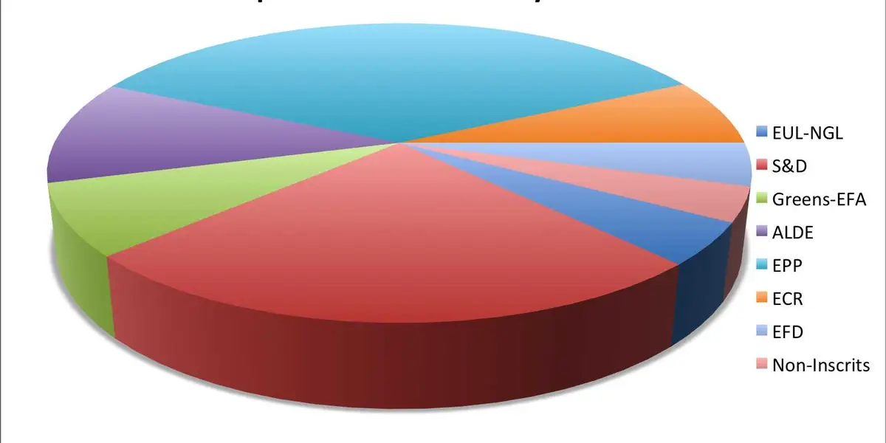

- # Organisation
	- Course materials
	  collapsed:: true
		- {{embed ((643f8bfc-4718-417d-a94f-c5d69dd55657))}}
	- Registration
	  collapsed:: true
		- Modulprüfung
		- 3 or 6 ECTS?
		- open issues?
	- Requirements
	  collapsed:: true
		- {{embed ((643f9161-7138-4163-b0f8-3d4062c3d0a2))}}
	- Course description
	  collapsed:: true
		- {{embed ((643f2336-49a4-4364-b906-c9632e169d1a))}}
	- Course concept
	  collapsed:: true
		- {{embed ((643f2336-e267-4976-9017-68fc5b30e5b5))}}
	- Course schedule
	  collapsed:: true
		- {{embed ((643f2336-673c-4882-afe2-ede089a86ea0))}}
- # Course overview
	- [[note-taking]]
	  collapsed:: true
		- the principle of networked notes
			- {{embed ((643f1b0f-deea-46d1-adc1-c8f2443661bc))}}
		- Using [[logseq]]
			- a knowledge graph
				- 
			- taking notes on [[references]]
				- 
	- [[research questions and hypotheses]]
	  collapsed:: true
		- 
	- [[references]] management
	  collapsed:: true
		- 
	- [[self-management]]
	  collapsed:: true
		- 
	- [[reading]] and [[writing]]
	  collapsed:: true
		- 
	- [[presenting]]
	  collapsed:: true
		- 
	- [[data]] and [[methods]]
	  collapsed:: true
		- [[dictionaries]]
		  collapsed:: true
			- 
		- [[corpora]]
		  collapsed:: true
			- [[Sketch Engine]]
				- 
			- [[english-corpora.org]]
				- 
		- [questionnaires]([[questionnaire]])
		  collapsed:: true
			- 
	- [[data analysis]]
	  collapsed:: true
		- using [[Microsoft Excel]]
			- using [[tables]]
			  collapsed:: true
				- 
			- using [[pivot tables]]
			  collapsed:: true
				- 
			- creating [[plots]] for [[visualisation]]
			  collapsed:: true
				- 
	- presenting [[results]]
	  collapsed:: true
		- 
- # Motivations, expectations, and goals
	- What is your background?
	  collapsed:: true
		- previous experience, study programme, field of linguistics, etc.
	- What kind of a project are you going to work on?
	  collapsed:: true
		- **type**: term paper, BA thesis, Zulassungsarbeit etc.
		- **domain**: (linguistic) field, supervisor
		- **deadline**: when are you planning to conduct and finish your project?
	- Which topic are you planning to write your paper about?
	- Which data and methods are you planning to use?