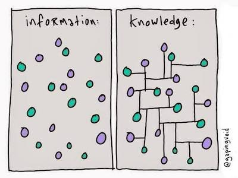

- # organisation
	- registration
	  collapsed:: true
		- {{embed ((643f815f-94c1-4baf-b4da-4dfbc8a14e46))}}
	- Modulprüfung
	- requirements
	  collapsed:: true
		- {{embed ((643f9161-7138-4163-b0f8-3d4062c3d0a2))}}
- # course overview
	- {{embed ((643f8370-b798-4ba7-be84-df4f12efc6ab))}}
- # [[note-taking]]
	- principles and tools
		- plain text
		  collapsed:: true
			- {{embed [[plain text]]}}
		- networked notes
		  collapsed:: true
			- the principle
			  collapsed:: true
				- [[mental lexicon]]
				  collapsed:: true
					- 
				- networked notes
				  collapsed:: true
					- 
			- [[Zettelkasten]] method
			  collapsed:: true
				- 
				- **origin**: sociologist Niklas Luhmann
				- **book**: [[Ahrens2017ZettelkastenPrinzipErfolgreich]]
				- **website**: https://zettelkasten.de/
			- selected tools
			  collapsed:: true
				- free options (recommended)
				  collapsed:: true
					- [[logseq]]
					- [Obsidian](https://obsidian.md/)
				- paid: [Notion](https://www.notion.so/)
	- [[hands-on]]: taking notes using [[logseq]]
	  collapsed:: true
		- TODO install logseq
		- TODO create a new graph
		- TODO start with the [template]([[student page]]) for your personal page
		  collapsed:: true
			- TODO download `student page.md` from [this](https://raw.githubusercontent.com/wuqui/methling231/main/pages/student%20page.md) link
			- TODO copy it the `pages` folder in your graph directory
			- TODO name it using your second name + first name’s initial, e.g. `WuerschingerQ`
		- TODO fill in the template
		  collapsed:: true
			- TODO answer the questions provided
			- TODO link to important concepts and keywords (e.g. [[corpus linguistics]], [[Twitter]])
		- TODO upload your personal page to our shared folder [here](https://syncandshare.lrz.de/getlink/fiNpRN4FB9181jt53gvaxB/) on [[LRZ Sync and Share]]
		-