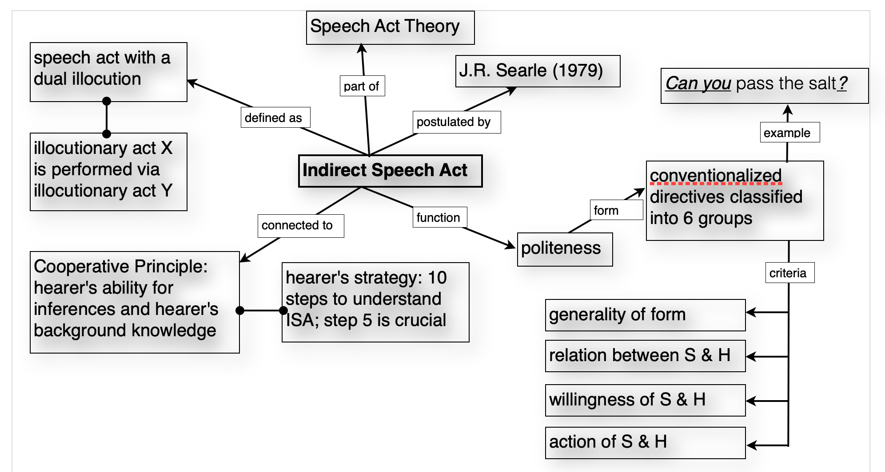

- # What to read for your project?
  collapsed:: true
	- start with **general introductions** giving you the broader picture
	- **narrow down** your reading to more specific articles, focussing on individual theoretical concepts
	- with each reading refine your **keyword list** to gradually cover the whole research area
	- if you're unsure about the relevance of a text, **skim**: read the abstract, table of contents or index and check for notions that seem to relate to your topic
	- make sure to include the **latest publications** on your topic
	- once you get the same sources in the reference section of the texts you read over and over again and no new relevant publications can be found, your reading list has reached the **saturation point**
- # How to read?
  collapsed:: true
	- ## Modes of reading
		- **scanning**
			- quick reading, looking for key words
		- **skimming**
			- cross-reading of the whole text; identification of passages to be read more closely later on
		- **selective reading**
			- reading only those passages of the text relevant to your topic
			- the table of contents and/or the index can help you identify relevant passages or with an eletronic source use the search function and look for keywords
		- **close reading**
			- careful and critical reading of the full text
			- usually involves taking notes, highlighting, commenting etc.
			- develop a system that works for you and use it consistently
		- **creative reading**
			- reading with an open mind for inspiration of own ideas
		- maybe except for the last type, you should always take notes while reading
	- ## SQ4R method
		- 
		- **recite**: also **relate** the information to relevant concepts related to your topic
- # Reading and [[writing]]
  collapsed:: true
	- Reading with a specific topic in mind is always tightly linked to writing. For core texts it is advisable to produce an **excerpt**, so that you do not only rewrite the original text, but process the information contained in the literature, formulate it **in your own words** and adjust it to your topic.
	- ## First reading
		- get a **general picture** and an outline of the text;
		- note down the **structure** (headings, chapters, sections, paragraphs) on a piece of paper (index cards or first page of a computer file)
		- indicate **irrelevant parts** of the text
	- ## Second reading
		- **topic** of each chapter, section, paragraph
		- **summary** of each chapter, section, paragraph
		- names of important **authors/sources**, e.g. for further reading
		- note down possible **quotations** (indicate pages and page break in the quotation)
		- note down helpful **examples**, **tables**, and **figures**
		- summarize aspects that are relevant to your own work, mark potential links to your **research questions** or to chapters in your table of contents
		- make notes to yourself indicating **questions**, unclear explanations, links to other texts you've read
- # Highlighting and marking
  id:: 64762078-9f92-47fb-a7b1-83b8010693eb
  collapsed:: true
	- you can directly work with a photocopy or a **PDF** of the text and highlight and mark all necessary information and thus prepare a commented version.
	- you can use a system of **colours** to work out the structure of the text
	- **highlight** names of authors and researchers, definitions, examples and possible quotations in different ways
	- comment on the **margins** with keywords, paraphrases, summaries, etc.
	- **cross out** passages that are not important for your work
	- additionally, use **post-its**, for notes to yourself indicating cross-references to other texts, own ideas, and problematic passages
	- all of this works really well when using **[[Zotero]]'s PDF reader**
- # Visualisations
  collapsed:: true
	- 
- # Strategies for difficult passages
  collapsed:: true
	- cf. [[Cottrell2013StudySkills]] 168f.
	- If you have the feeling that you don't understand what you're reading or that you cannot make sense of it, check the following issues:
		- make sure you have the necessary **theoretical background** for the text 
– if not, go back to a more general, introductory text.
		  logseq.order-list-type:: number
		- try to briefly **sum up** what you have read after a few sentences
		  logseq.order-list-type:: number
		- try to read with a **specific question** in mind in order to get an answer from the text
– if 2 or 3 do not work, re-read the passage, read it aloud
		  logseq.order-list-type:: number
		- **highlight** and colour-code relevant notions (see [Section](((64762078-9f92-47fb-a7b1-83b8010693eb))) on highlighting)
		  logseq.order-list-type:: number
		- Ask questions
		  logseq.order-list-type:: number
			- What does the author want to show?
			- Is there a particular question behind this passage?
			- Why is the passage relevant?
			- Is it relevant for my topic?
			- What do I learn from this?
- # Critical evaluation
  collapsed:: true
	- [[Cottrell2013StudySkills]]: 187–196
		- find and evaluate the **line of reasoning** – is the information relevant to the topic, logical, understandable, not circular?
		- does the text have a **logical structure**?
		- are aspects **explained** before they are applied?
		- is there **evidence** to support the claims, is it appropriate and reliable, are any relevant issues missing?
		- do the **conclusions** make sense, are they clearly stated and well thought through?
		- does the **evidence** support the **conclusions**?