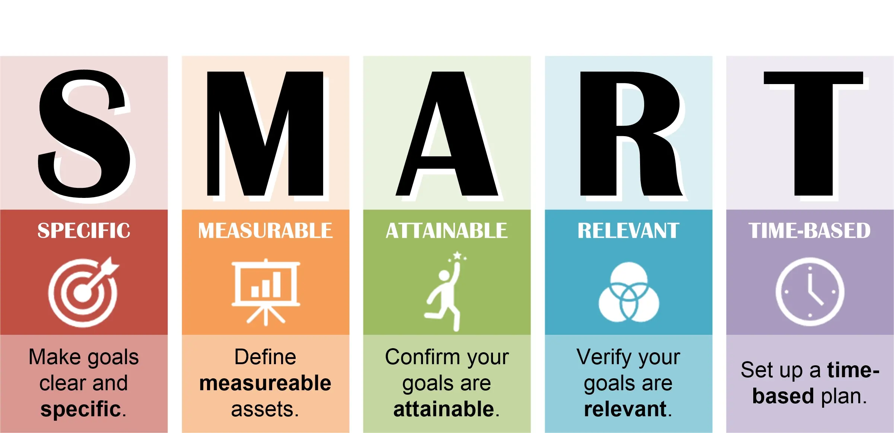
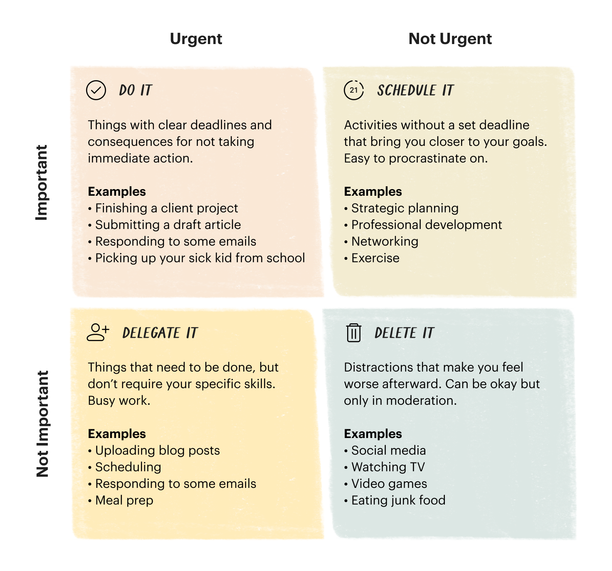
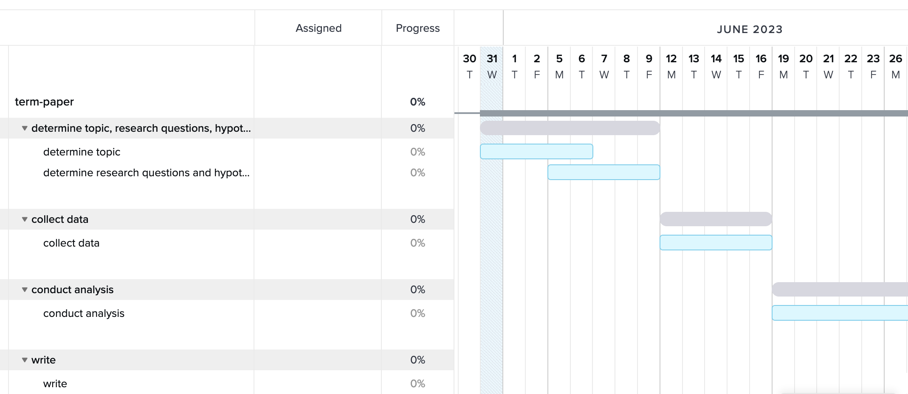

- # general principles
  collapsed:: true
	- keep it **simple**, both in terms of planning and tools
	- almost any **system** can work for you, as long as it's a system and you use it and stick to it consistently
- # setting SMART goals
  collapsed:: true
	- 
- # managing todos
  collapsed:: true
	- include all your TODOs
	  collapsed:: true
		- from other projects/jobs
		- from private commitments
	- setting todos the right way
	  collapsed:: true
		- they should be **actionable**
		- they should have a **date**
			- **scheduled**: when are you planning to start working on it?
			- **deadline**: when does this need to be finished?
	- make a **plan**
	  collapsed:: true
		- make a weekly plan (with time slots)
		- make a daily plan (with times slots)
	- **review** your days, weeks, months, year
	- **prioritise** and your productive time to work on important tasks
	  collapsed:: true
		- Eisenhower matrix
		  collapsed:: true
			- 
		- Marbles in a jar
		  collapsed:: true
			- https://www.youtube.com/watch?v=SqGRnlXplx0&ab_channel=MeirKay
		- Pareto's law
		  collapsed:: true
			- 20 % of actions can give you 80 % of the results.
			- The remaining 20 % will require 80 % of the time.
	- tools
	  collapsed:: true
		- pen and paper
		- e.g. [todoist](https://todoist.com/) (thousands of similar apps available)
		- [[logseq]]
	- frameworks for 'getting things done'
		- [Getting Things Done](https://gettingthingsdone.com/) by David Allen
		- [Zen to Done](https://zenhabits.net/zen-to-done-ztd-the-ultimate-simple-productivity-system/): a simpler version of GTD, by Leo Babauta
- # making a time plan
  collapsed:: true
	- start with the **end** in mind: work backwards from the deadline
	- use **buffers**: everythings takes longer than we think
	- tools
	  collapsed:: true
		- calendar
		- Gantt charts
			- 
- # further reading
	- [[Cottrell2013StudySkills]]: 121–150
- # [[practice]]: make a time plan
	- project agenda
		- TODO determine topic, research questions, hypotheses
		- TODO find and read previous literature
		- TODO collect and pre-process data
		- TODO conduct analysis, gather results
		- TODO write the paper
		- TODO revise your writing
	- options for tools
		- pen and paper
		- digital calendar
		- [TeamGantt](https://www.teamgantt.com/)
		  collapsed:: true
			- 